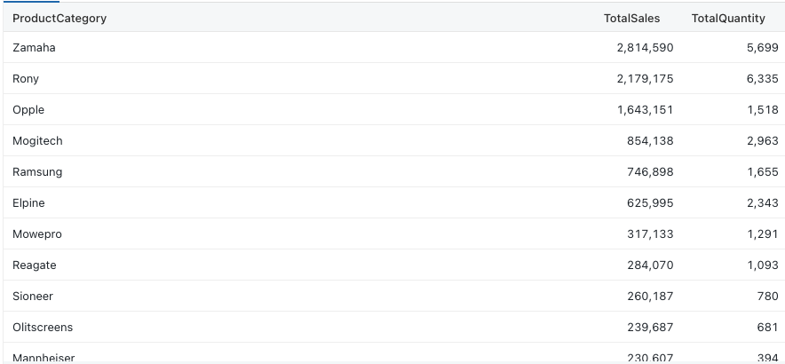
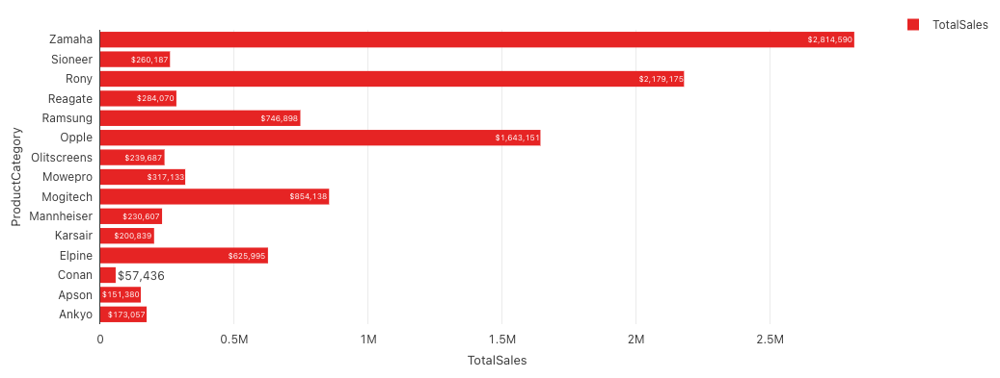
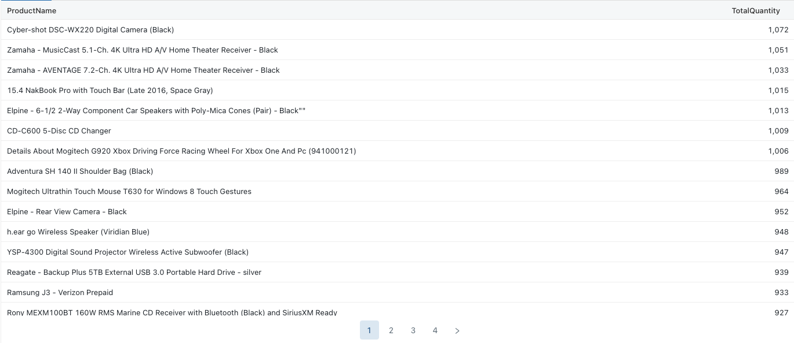
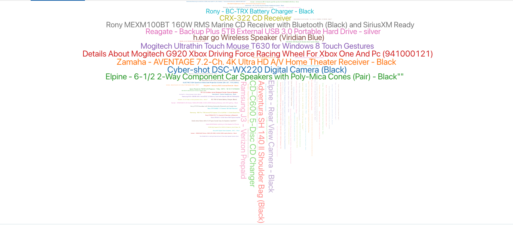
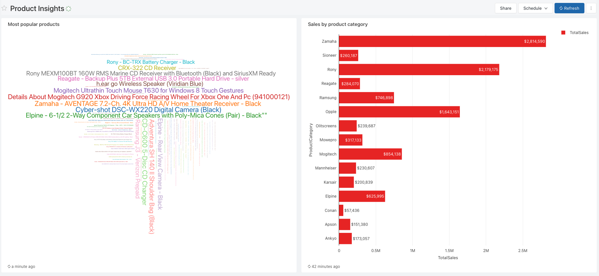
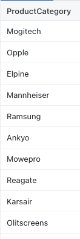
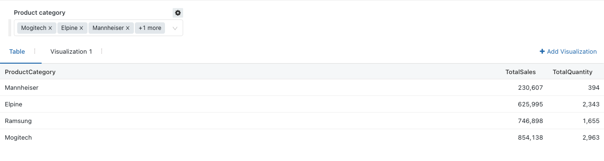
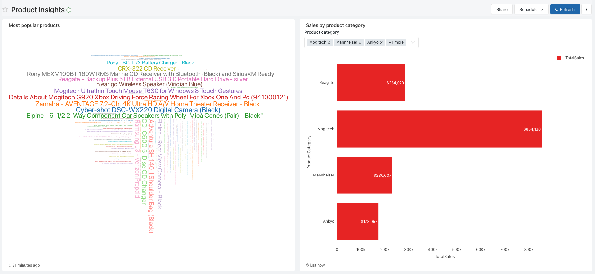

# Instructions

## Getting to Databricks SQL 
1. At the bottom of the sidebar within the Databricks web user interface, click the app switcher icon and select ‘SQL.
2. Tap the ‘Queries’ icon in the sidebar.
3. Click the ‘New Query’ button.
4. Your SQL endpoint should already be selected. If it is not, please use the menu to select or create an appropriate SQL endpoint.


## Challenge 1: Product sales and quantity by product categories

### Business challenge

> "As the divisional manager of the company, I would like to know my best selling product categories based on sales."

### Task

#### Part 1: Create query

Write a query with the name `'Sales by product category'` that will return the following result: 




<details>
<summary><strong>Show solution</strong></summary>

```sql
SELECT 
    ProductCategory, 
    SUM(OrderAmount) TotalSales, 
    SUM(Quantity) TotalQuantity
FROM your_database_name.sales_order_gold
GROUP BY ProductCategory
ORDER BY TotalSales DESC; 
```

</details>

<br>

#### Part 2: Create visualisation

Create a visualisation that looks like: 



<details>
<summary><strong>Show solution</strong></summary>

1. Click on 'add visualization' 
2. Select 'visualization type' : 'Bar' 
3. Under the 'general' tab, tick 'horizontal chart' 
4. Y Column: 'ProductCategory'
5. X Columns: 'TotalSales'
6. Under the 'Y axis' tab, turn on 'Reverse Order'
7. Under the 'colors' tab, select 'red' 
8. Under the 'Data Labels' tab, select 'Show Data Labels' 
9. Add '$' at the front of the number values format field 
10. Select 'Save'

</details>

## Challenge 2: Most popular products 

> "As the divisional manager of the company, I would like to know my most popular products" 

#### Part 1: Create query

Write a query with the name `'Most popular products'` that will return the following result: 




<details>
<summary><strong>Show solution</strong></summary>

```sql
SELECT 
    ProductName,
    SUM(Quantity) TotalQuantity 
FROM your_database_name.sales_order_gold_agg
GROUP BY ProductName
ORDER BY TotalQuantity DESC; 
```

</details>

<br>


#### Part 2: Create visualisation

Create a visualisation that looks like: 



<details>
<summary><strong>Show solution</strong></summary>

1. Click on 'add visualization' 
2. Select 'visualization type' : 'Word Cloud' 
3. Under the words column, select 'ProductName'
4. Under the Frequencies column, select 'TotalQuantity'
10. Select 'Save'

</details>


## Challenge 3: One dashboard to rule them all 

> "I like what you have done for the first two challenges, but now I would like to easily access the visualisations you've created in a single page." 

#### Create Dashboard

Create a dashboard with the name `"Product Insights"` that looks like: 



<details>
<summary><strong>Show solution</strong></summary>

1. On the left panel, click on 'Dashboards'
2. Click on 'Create Dashboard' and provide the name 'Product Insights'
3. Click on 'Add Visualisation' and select each one of the visualisations to add to the dashboard
4. Select 'Done editing' 

</details>

## Challenge 4: Parameterising queries 

> "The dashboard is looking slick, but I would like to be able to filter my dashboard visuals dynamically based on the Product Category."

#### Part 1: Create distinct product category query 

Create a new query with the name `'Distinct Product Category'` which looks like: 



<details>
<summary><strong>Show solution</strong></summary>

```sql
SELECT 
    ProductCategory 
FROM your_database_name.product_gold 
GROUP BY ProductCategory; 
```

</details>
<br>

#### Part 2: Update Sales by product category

Update the existing query `Sales by product category` and modify the query to check if `ProductCategory` is in the user dropdown list selection.

See instructions here: https://docs.databricks.com/sql/user/queries/query-parameters.html#query-based-dropdown-list

The result should look like: 



<details>
<summary><strong>Show solution</strong></summary>

1. Select the 'add new parameter icon' (the icon with the `{}` symbol)
2. Type in the keyword: 'product_category'
3. Select Type: 'Query Based Dropdown List'
4. Select the query you have created in the earlier step: 'Distinct Product Category'
5. Select 'Add parameter' 
6. Modify your SQL Query to the following: 

```sql
SELECT 
    ProductCategory, 
    SUM(OrderAmount) TotalSales, 
    SUM(Quantity) TotalQuantity
FROM your_database_name.sales_order_gold
WHERE ProductCategory IN ({{ product_category }})
GROUP BY ProductCategory
ORDER BY TotalSales ASC; 

```
7. In the product category dropdown list, select product categories of your choice and click apply. 

</details>

<br>

#### Part 3: Update Dashboard

Go to your dashboard, and select product categories of your choice and click apply. You should see the following result: 


