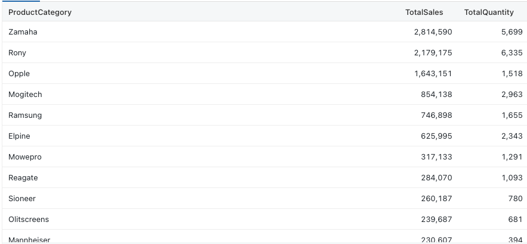
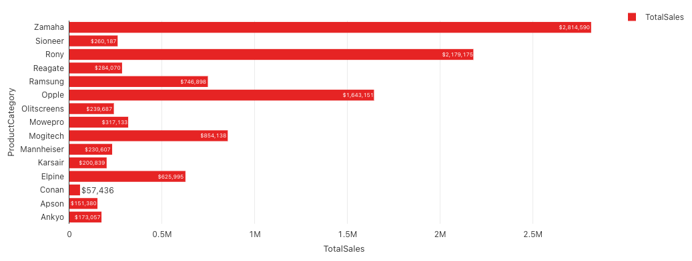
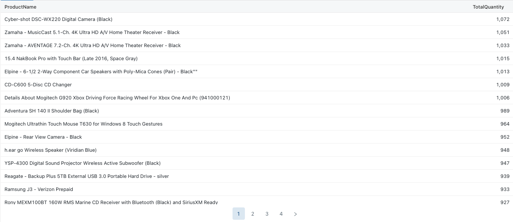
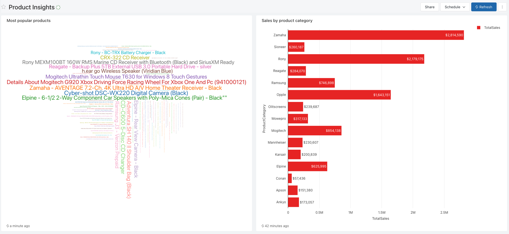
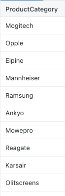
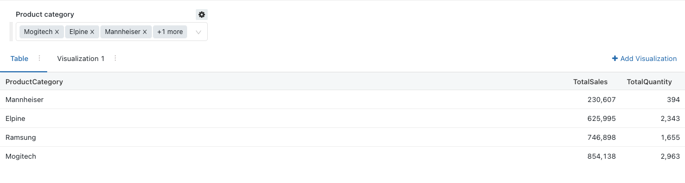
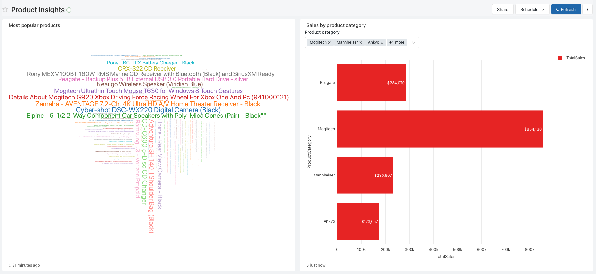

# Instructions

## Getting to Databricks SQL 
1. At the bottom of the sidebar within the Databricks web user interface, click the app switcher icon and select ‘SQL.
2. Tap the ‘Queries’ icon in the sidebar.
3. Click the ‘New Query’ button.
4. Your SQL endpoint should already be selected. If it is not, please use the menu to select or create an appropriate SQL endpoint.

## Challenge 1: Product sales and quantity by product categories

### Business challenge

> "As the divisional manager of the company, I would like to know my best selling product categories based on sales."

### Task

#### Part 1: Create query

Write a query with the name `'Sales by product category'` that will return the following result: 

 

#### Part 2: Create visualisation

Create a visualisation that looks like: 

## Challenge 2: Most popular products 

> "As the divisional manager of the company, I would like to know my most popular products" 

#### Part 1: Create query

Write a query with the name `'Most popular products'` that will return the following result: 

 

#### Part 2: Create visualisation

Create a visualisation that looks like: 

## Challenge 3: One dashboard to rule them all 

> "I like what you have done for the first two challenges, but now I would like to easily access the visualisations you've created in a single page." 

#### Create Dashboard

Create a dashboard with the name `"Product Insights"` that looks like: 

## Challenge 4: Parameterising queries 

> "The dashboard is looking slick, but I would like to be able to filter my dashboard visuals dynamically based on the Product Category."

#### Part 1: Create distinct product category query 

Create a new query with the name `'Distinct Product Category'` which looks like: 

 

#### Part 2: Update Sales by product category

Update the existing query `Sales by product category` and modify the query to check if `ProductCategory` is in the user dropdown list selection.

See instructions here: https://docs.databricks.com/sql/user/queries/query-parameters.html#query-based-dropdown-list

The result should look like: 

 

#### Part 3: Update Dashboard

Go to your dashboard, and select product categories of your choice and click apply. You should see the following result: 

