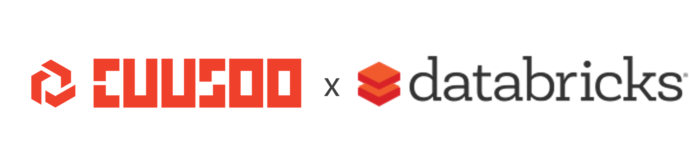

# Welcome to the Databricks Bootcamp

This bootcamp has been prepared in collaboration between [Cuusoo](https://www.cuusoo.com.au/) and [Databricks](https://databricks.com/). 

The bootcamp aims to provide participants with:

- Ability to perform data engineering tasks with Databricks, including batch and stream ingestion. 
- Deep understanding of the delta lake file format in relation to the data lakehouse architecture.  
- Ability to perform data analysis through Databricks SQL. 
- Ability to perform machine learning in Databricks. 
- Ability to perform MLOps through ml-flow in Databricks. 

# Outline

| No | Topic |
| -- | -- |
| 01 | Delta lake |
| 02 | Batch ingestion |
| 03 | Stream ingestion |
| 04 | Autoloader ingestion |
| 05 | Databricks SQL |
| 06 | Machine learning and MLflow | 

# Content structure

There are 3 types of content in this repository:

- `evr` : contains activities where everyone will attempt together (instructor and students)
- `ins` : contains activities that only the instructor will attempt for demonstration purposes. Students are welcome to follow along.
- `stu` : contains activities that students will attempt. The solutions will be reviewed at the end of the exercise.

Within each activity folder, there will be sub-folders for:

- `unsolved`: contains the unsolved starter code. Students should refer to the Python comments for instructions for the activity.
- `solved` : contains the solved solutions. `stu` activities will not contain the solved solutions until the end of the day.

# Getting started 

Clone this git repository into your Databricks Repos by following the steps below (taken from [link](https://docs.databricks.com/repos.html#clone-a-remote-git-repository)):

1. Click Repos Icon Repos in the sidebar.
2. Click Add Repo.
3. In the Add Repo dialog, click Clone remote Git repo and enter the repository URL. Select your Git provider from the drop-down menu, optionally change the name to use for the Databricks repo, and click Create. The contents of the remote repository are cloned to the Databricks repo.

